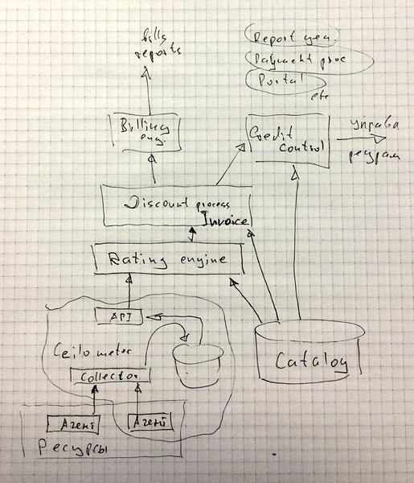

## Реферат
Архитектура билинга на основе Ceilometer — компонента OpenStack для сбора статистики. В архитектуру входит схема из 7-10 компонент, по одному абзацу на описание каждого. Цель работы — пройти собеседование на должность системного архитектора OpenStack. 

## Введение
Инфраструктурные облачные комплексы, предоставляющие услуги по требованию и нацеленные на эфективность развертывания информационных сервисов, завязаны на автоматизацию обслуживания и управление ресурсами.  Отсутствие контроля и автоматизации приводит к неэфективному использованию ресурсов, недоступность объективных показателей усложняет планирование. Таким образом, выделим три направления:

* самообслуживание или автоматическое обслуживание,
* составление отчётов по заданным показателям,
* отслеживание затрат и выставление счетов — биллинг.

Для достижения цели, прохождения собеседования, решается задача построения архитектуры биллинга, умеющего:

* быть типичной системой биллинга в понимании термина "order management", т.е. обслуживать жизненный цикл продажи ресурса;
* управлять тарифными планами, скидками, пакетами услуг;
* выставлять счета на основе тарифных планов, создавать обобщенные счета, поддерживать взаимозачёты;
* обеспечить "sales & marketing" — отражать комиссионные, вести маркетинговые кампании, управлять скидками, выдавать аналитические отчёты;
* обеспечить прямой интерфейс с пользователем;
* обеспечить pre- и post-paid, кредиты; 
* обрабатывать задолженности — реакция на просроченные платежи, отключение или уменьшение предоставляемых ресурсов;
* обрабатывать инциденты — поддерживать создание и ведение запросов, когда клиент не согласен со счётом, возврат средств;
* отслеживать quality-of-service, предоставлять отчеты;
* поддерживать разные валюты и языки;
* следить за консистентностью — "auditing & security". 

## Система биллинга
### Типичный биллинг
Типичный процесс биллинга выглядит следующим образом:

1. В процессе работы облака генерируются данные об используемых ресурсах, назовём их usage records.
2. Данные сохраняются до момента, пока не будут тарифицированы.
3. К данным из предыдущего шага, к rated records, применяются скидки, изменения цены и прочая маркетинговая обработка. Получаем invoice, данные попадают в счёт клиента.
4. Состояние счёта клиента управляет дальнейшим выделением ресурсов.
5. На основе счёта клиента формируются платёжные документы (bills).

### Архитектура системы
Система биллинга состоит из следующих частей:

1. Подсистемы Ceilometer, собирающей и хранящей usage records;
2. Каталога Catalog, который хранит бизнес-правила, информацию счетах, услугах, скидках и проч.
3. Подсистемы Rating engine, переводящей ресурсы в деньги;
4. Подсистемы Discount process или Invoice, генерирующей списания со счёта клиента;
5. Подсистемы Credit control, контролирующей расход средств и выделение ресурсов;
6. Интерфейса к OpenStack, управляющего распределением ресурсов;
7. Подсистемы Billing engine для управления счетами;
8. Подсистемы создания отчётов;
9. Подсистемы ведения платежей;
10. Интерфейса управления и портала пользователя.

Логическая схема приведена ниже.

Остановимся на компонентах подробнее.
Стандартный компонент OpenStack Ceilometer оснащается агентами, учитывающими потребление интересных нам ресурсов: использование процессорного времени, время работы приложения, объем дискового пространства и т.п. Статистика поступает в data store. Данный процесс идёт непрерывно. Вопрос, на уровне collector или на специальном mediation device преобразуются usage records, не прорабатывался.

Каталог — БД, которая содержит эту всю бизнес-логику:

* кто что купил;
* кто что оплатил;
* продукты;
* тарифные планы;
* подписки;
* правила тарификации;
* правила списания средств.

Rating engine пару (время, ресурс) переводит в пару (стоимость, ресурс). Требует проработки непрерывно ли идёт процесс, периодически, выборочно по ресурсам или применяется некая комбинированная схема.

Компонент Invoice выполняет одновременно две функции: переводит тарифицированные данные в цену для пользователя и запускает контроль расхода средств в компоненте Credit Control. В данном компоненте происходит разбор бизнес-правил, применение скидок, сличение пакетов услуг и проводятся взаимозачёты, что выливается в объединения тарифицированных данных.

Credit control списывает данные со счета пользователя, принимает решения по доступу клиента к ресурсам. Через интерфейс в OpenStack идёт управление ресурсами.

Подсистемы создания отчётов, счетов, аудита и проверок, обработки платежей и портал не прорабатывались. Не рассмотрен интерфейс к внешней CRM-системе.

## Заключение
Приведённая  архитектура не накладывает ограничений на бизнес-логику, масштабируется путём распараллеливания работы ключевых компонент, имеет модульные внешние интерфейсы. Для развития требуются исследования в области схем ведения учета ресурсов и уточнение порядка работы компонент.

